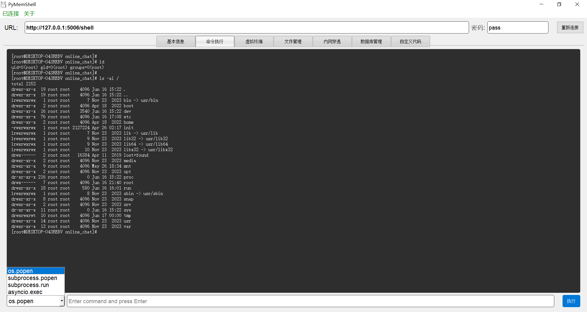
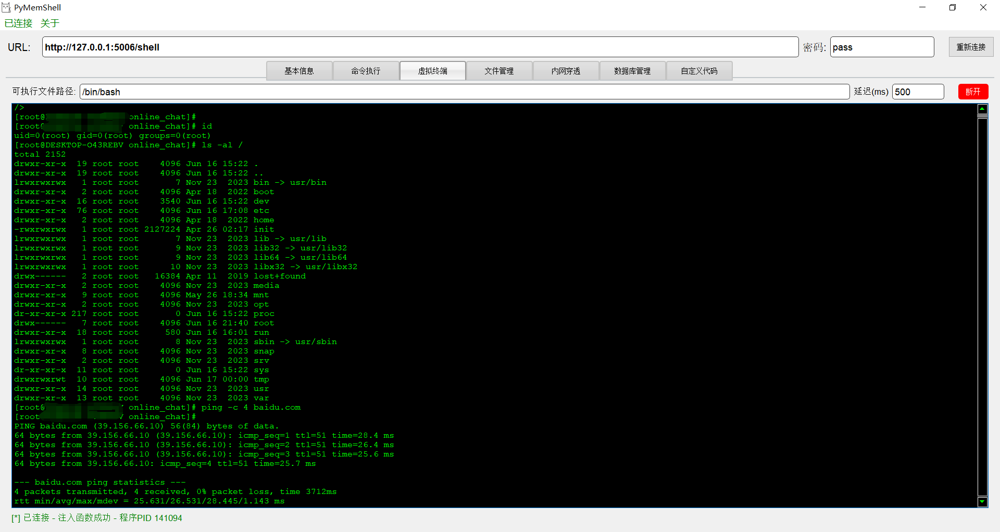
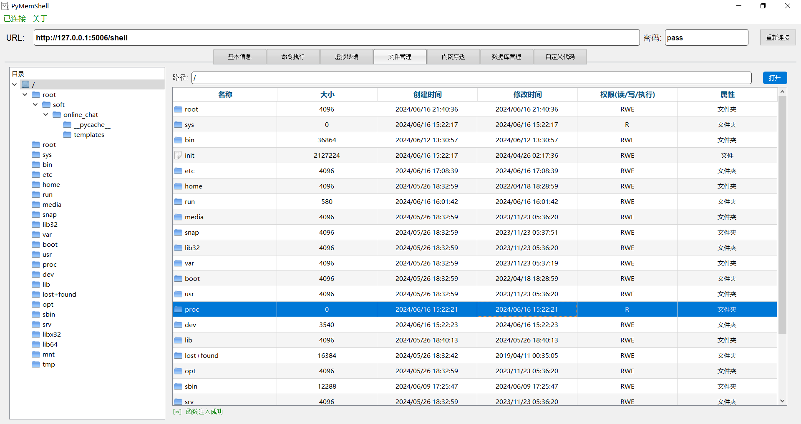

# PyMemShell
Python内存马管理工具

在此文[《Python Flask中的SSTI和内存马》](./Python%20Flask中的SSTI和内存马.md)的基础上进行工具的开发和Payload的设计。一个没有完成的工具，代码也不够规范。

## 使用

启动UI界面

```cmd
python3 MainUI.py
```

## 功能

实现的一些基本功能都是参照了冰蝎工具的设计。Payload的写法都依赖于Python自带的一些库实现，支持Windows/Linux，交互过程的流量加密是异或。

利用SSTI漏洞、反序列化漏洞注入内存马。

### 获取基础信息


### 命令执行窗口

多种命令执行模式



### 虚拟交互终端

有bug，主要是使用python中的subprocess.Popen模块获取输出流的时候并没有获取到完整的命令提示符行。



### 文件管理器

基本的文件操作：创建，删除，下载，上传。



### ~~内网穿透~~

### ~~数据库管理~~

### ~~自定义代码执行~~

